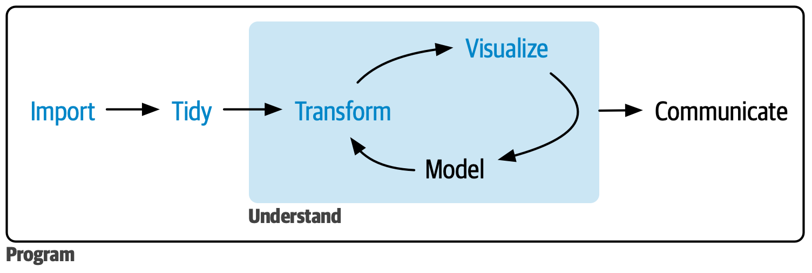

## Part 0: Whole Game

In this section of the repository, you'll work through practical examples that provide a quick overview of the core tools of data science: importing, tidying, transforming, and visualizing data, as shown in Figure 1. The goal is to help you experience the “whole game” of data science early on, using simple, real-world datasets. Later chapters in the book will explore each of these tools in greater depth, enabling you to tackle more complex challenges.

 Figure 1: In this section of the book, you’ll learn how to import, tidy, transform, and visualize data.

We will be covering the tools of data science and learning R programming in the process (these are two seperate things!). First we will learn the basics of 1. Data Vizualization, 3. Data Transformation, 5. Data Tidying and 7. Data import. Between the parts we will cover R workflows 2. Workflow Basics, 4. Workflow: Code style, 6. Workflow: Scripts and projects.

This course will focus on Data science as it is applied using R, however, we will also be reviewing other tools and workflows like Excel and Powerquery to help in your day to day bussiness needs.