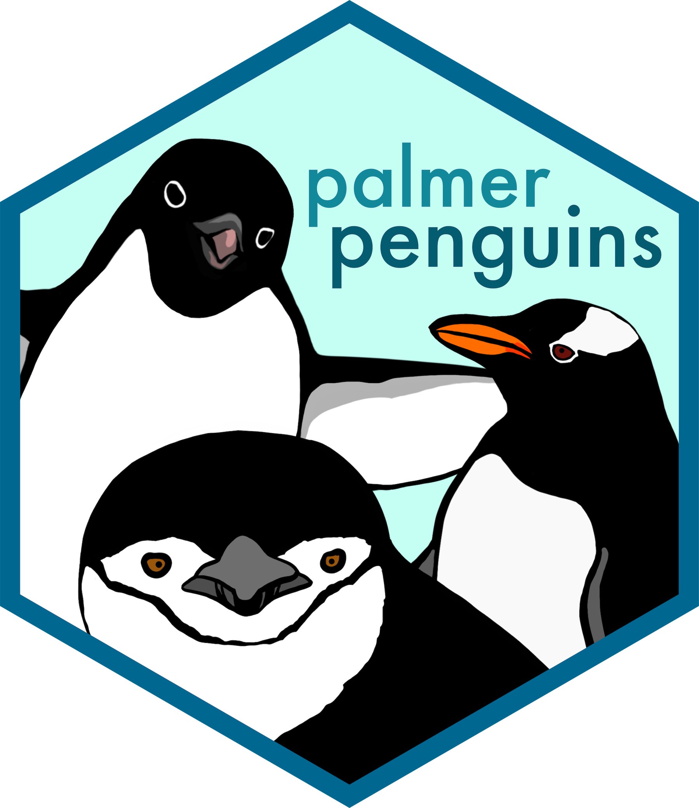
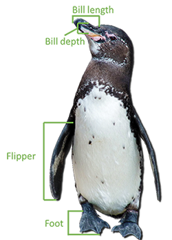
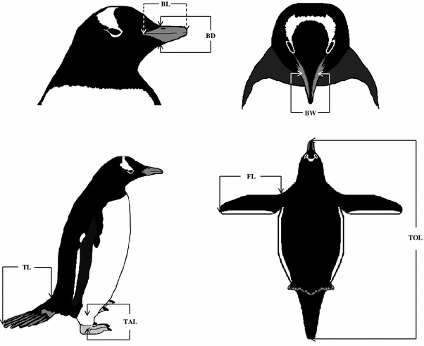
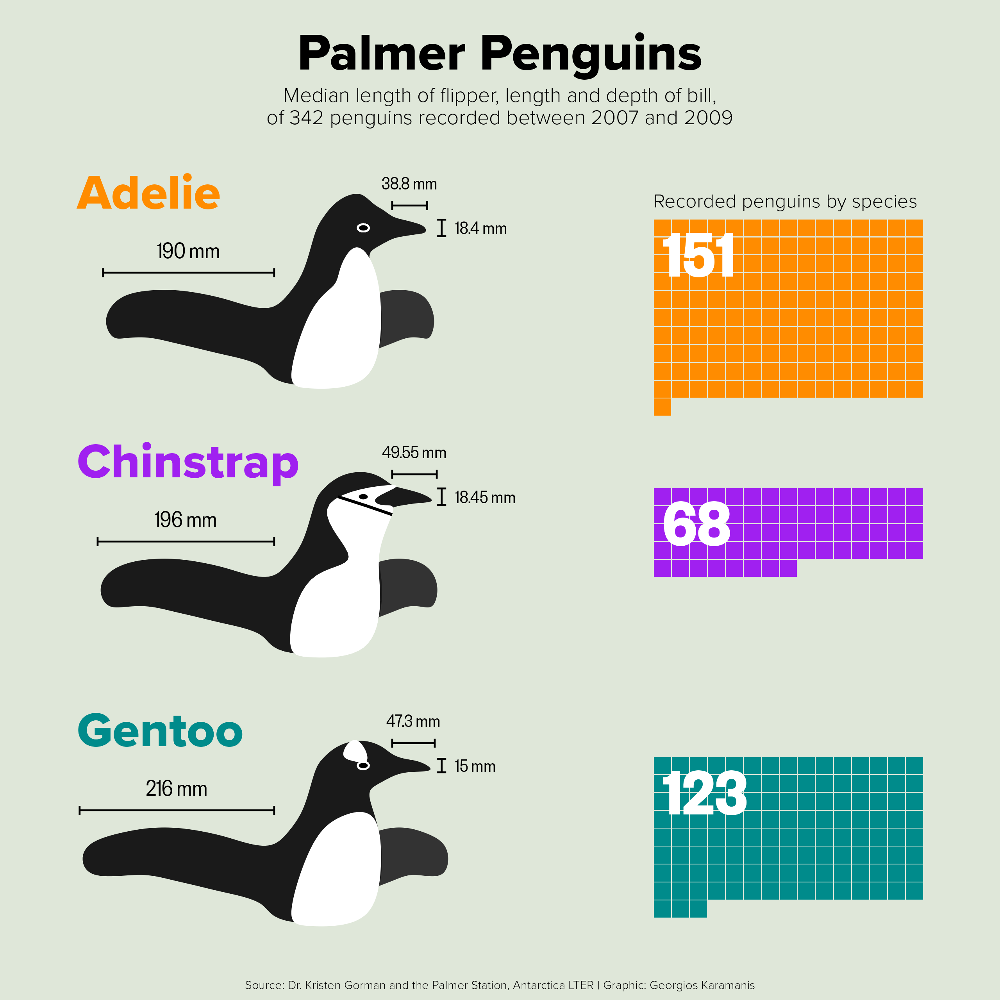
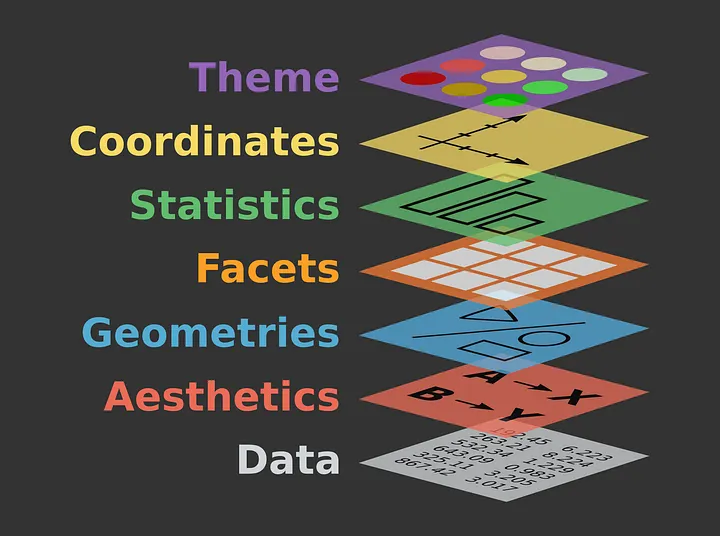

## Part 1: Data Visualization

Welcome to the Penguin Data Exploration Section In this section, you’ll begin your journey into data analysis using the Palmer Penguins dataset. This hands-on activity will guide you through essential steps in working with data in R:

1.  Installing and Loading Packages
2.  Loading and Exploring the Penguin Dataset
3.  Creating a simple plot to visualize relationships
4.  Dataframes, data types and variables.
5.  Using help pages to understand the data

These foundational skills will help you explore questions like: Do penguins with longer flippers weigh more than those with shorter ones? and Does this relationship vary by species or location? Before diving in, we invite you to Meet the Palmer Penguins by visiting the official introduction to the dataset: 🔗 <https://allisonhorst.github.io/palmerpenguins/articles/intro.html>

## 

------------------------------------------------------------------------

# 1. Installing and Loading Packages

In R, a package is a collection of functions, data, and documentation that extends R’s capabilities. For example, some packages help with data visualization, others with statistical modeling, and some provide datasets like the palmerpenguins package.

**Why Install a Package?** R comes with a set of base functions, but many tasks require additional tools. Installing a package gives you access to these tools. Packages are typically hosted on <https://cran.r-project.org>, R’s official repository.

**How to Install a Package** Use install.packages() to download and install a package from CRAN:

``` r
# installing a package then loading it using the install.packages() and library() functions 
install.packages("tidyverse") 
```

**How to Load a Package** After installation, use library() to load the package into your current R session:

``` r
library(palmerpenguins)
```

You need to load the package every time you start a new R session.

**Checking the Package Version** Each package has a version number that indicates its release and update history. To check the version:

``` r
packageVersion("palmerpenguins")
```

**What Is a Package Version?** A package version helps track updates and compatibility. For example, version 1.0.2 might be followed by 1.0.3, which includes bug fixes or new features. This is important when sharing code or troubleshooting.

⚠️ You only need to install a package once, but you need to load it every time you start a new R session.

``` r
library(tidyverse)
```

Now lets load the data set (palmerpenguis) and the themes for the plot(ggthemes)

``` r
library(palmerpenguins)
library(ggthemes)
```

------------------------------------------------------------------------

# 2. Loading and Exploring the Penguin Dataset

Do penguins with longer flippers weigh more or less than penguins with shorter flippers? You probably already have an answer, but try to make your answer precise. What does the relationship between flipper length and body mass look like? Is it positive? Negative? Linear? Nonlinear? Does the relationship vary by the species of the penguin? How about by the island where the penguin lives? Let’s create visualizations that we can use to answer these questions.

But first lets understand `dataframes` since the `penguins` data is stored in one (a.k.a. palmerpenguins::penguins)

**Load the Dataset**

``` r
palmerpenguins::penguins
```

``` r
data("penguins")
```

This loads the penguins dataset into your environment. It contains observations of three penguin species from the Palmer Archipelago in Antarctica.

**The penguins data frame**

The panguins dataframe will help you in answering the initials questions. A data frame is a rectangular collection of variables (in the columns) and observations (in the rows). penguins contains 344 observations collected and made available by Dr. Kristen Gorman and the Palmer Station, Antarctica LTER2.

To make the discussion easier, let’s define some terms:

-   A **variable** is a quantity, quality, or property that you can measure.
-   A **value** is the state of a variable when you measure it. The value of a variable may change from measurement to measurement.
-   An **observation** is a set of measurements made under similar conditions (you usually make all of the measurements in an observation at the same time and on the same object). An observation will contain several values, each associated with a different variable. We’ll sometimes refer to an observation as a data point.
-   **Tabular data** is a set of values, each associated with a variable and an observation. Tabular data is tidy if each value is placed in its own “cell”, each variable in its own column, and each observation in its own row.

In this context, a variable refers to an attribute of all the penguins, and an observation refers to all the attributes of a single penguin.

Type the name of the data frame in the console and R will print a preview of its contents. Note that it says tibble on top of this preview. In the tidyverse, we use special data frames called **tibbles** that you will learn more about soon.

**Preview the Data**

Use head() to view the first few rows:

``` r
head(penguins)
```

Use glimpse() for a quick overview of the structure:

``` r
glimpse(penguins)
```

**Check for Missing Values**

``` r
summary(penguins)
```

## This helps identify any missing or unusual values in the dataset.

------------------------------------------------------------------------

# 3. Visualizing Flipper Length vs. Body Mass

  

**Basic Scatter Plot**

``` r
ggplot(data = penguins, aes(x = flipper_length_mm, y = body_mass_g)) +  
    geom_point() +  
    labs(title = "Flipper Length vs Body Mass",       x = "Flipper Length (mm)",       y = "Body Mass (g)")
```

**Colored by Species**

``` r
ggplot(data = penguins, aes(x = flipper_length_mm, y = body_mass_g, color = species)) +  
    geom_point() +  
    labs(title = "Flipper Length vs Body Mass by Species")
```

**Faceted by Island**

``` r
ggplot(data = penguins, aes(x = flipper_length_mm, y = body_mass_g, color = species)) +  
    geom_point() +  
    facet_wrap(~ island) +  
    labs(title = "Flipper Length vs Body Mass by Island")
```

These plots will help us to visually assess:

-   Whether the relationship is positive (do heavier penguins have longer flippers?).

-   Whether it appears linear or nonlinear.

-   

    ## How species and island affect the relationship.

------------------------------------------------------------------------

# Additional content - The Grammer of Graphics

**Have You Ever Wondered How Amazing Graphics Are Made?**

Have you ever looked at a beautiful data visualization and thought: *How did they make that?* Was it just random trial and error, or is there a structured way to build such visuals?

The truth is, great graphics are not made by chance. They follow a **language**—a system of rules and components that work together to tell a story with data. This system is called the **Grammar of Graphics**.

*What Is the Grammar of Graphics?*

The Grammar of Graphics is a conceptual framework for building plots. Just like sentences are built from nouns, verbs, and adjectives, graphics are built from:

-   **Data**: The information you want to visualize.
-   **Aesthetics**: Visual mappings like position, color, size.
-   **Geometries**: The shapes used to represent data (points, lines, bars).
-   **Facets**: Splitting data into subplots.
-   **Scales and Coordinates**: Controlling axes and layout.
-   **Themes**: Styling the overall appearance.



This grammar allows you to build complex, layered, and meaningful visualizations in a consistent and logical way. Here is a link to an article that explains it in more depth: <https://medium.com/aiskunks/a-crash-course-in-data-data-visualization-grammar-of-graphics-6d05bcc8e4a>.
